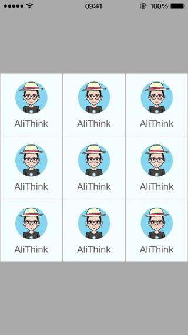

# ImageCenterButton
===============



An UIButton with TopImage and BottomLabel
## What

ImageCenterButton is a subclass of UIButton. Use it you can make a button with imageview upon the button textlabel easily.

## Features

* Dynamic image frame generated
* Spacing between imageview and textlabel customization 
* Image padding customization
* Round image support
* Dynamic button backgroundColor customization

## CocoaPods
To use ImageCenterButton add the following to your Podfile

    pod 'ImageCenterButton'

## Usage
```objective-c
// Round Image
@property BOOL imageIsRound;
// Image Padding
@property CGFloat padding;
// Spacing between imageview and textlabel
@property CGFloat imageTextSpace;
// Maximum imageview size
@property CGSize imageViewMaxSize;
// Button backgroundHighlighted
@property(nonatomic, strong) UIColor *backgroundHighlightedColor;
// Button backgroundNormal
@property(nonatomic, strong) UIColor *backgroundNormalColor;
```
 
## License

ImageCenterButton is available under the MIT license. See the LICENSE file for more info.

---
README(Chinese)
==========

## ImageCenterButton 是什么

ImageCenterButton 是UIButton的子类。可以用它很方便的生成图像在上文字标签在下的按钮。

## ImageCenterButton提供了哪些功能

 * 根据按钮大小动态调整图像大小
 * 图像与文字标签间距可定制
 * 图像padding可定制
 * 支持生成圆形图像
 * 按钮不同状态背景色可定制

## ImageCenterButton 使用配置
```objective-c
// 是否将图像设置成圆形
@property BOOL imageIsRound;
// 图像padding设置
@property CGFloat padding;
// imageview和textlabel间距设置
@property CGFloat imageTextSpace;
// imageview最大尺寸设置
@property CGSize imageViewMaxSize;
// Button高亮状态背景色设置
@property(nonatomic, strong) UIColor *backgroundHighlightedColor;
// Button普通状态背景色设置
@property(nonatomic, strong) UIColor *backgroundNormalColor;
```

## CocoaPods 支持

你可以在 Podfile 中加入下面一行代码来使用ImageCenterButton

    pod 'ImageCenterButton'

## 协议

ImageCenterButton 被许可在 MIT 协议下使用。查阅 LICENSE 文件来获得更多信息。
